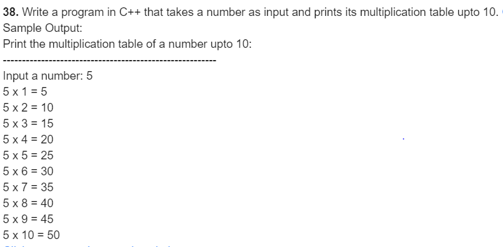
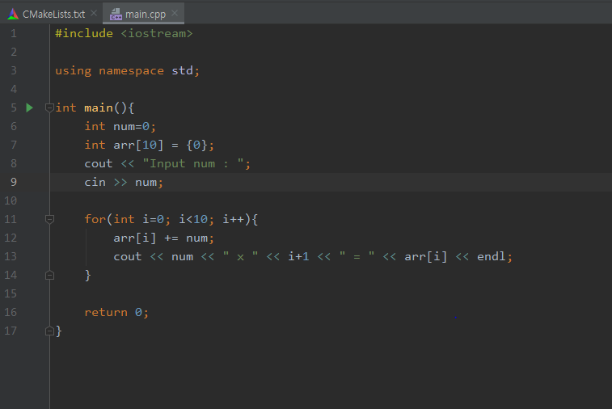
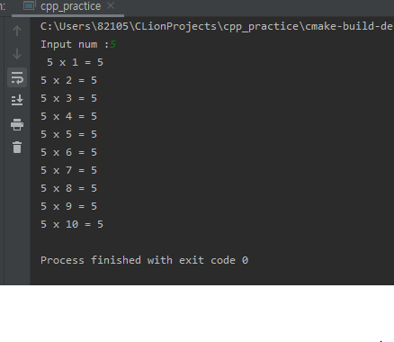

### 38

***

***

- 풀이과정
  1. 숫자를 정한다.
  2. 정한 숫자의 1배부터 10배 까지 구한다.

***

**source code**

***

**result**

***

* 변수 명세표

| 이름 | 자료형 | 사용목적                           |
| ---- | ------ | ---------------------------------- |
| num  | int    | 임의의 숫자                        |
| arr  | int    | 임의숫자와 1~10까지의 곱 결과 저장 |
| i    | int    | 반복문을 위한 변수                 |

