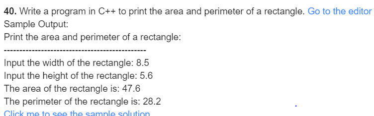
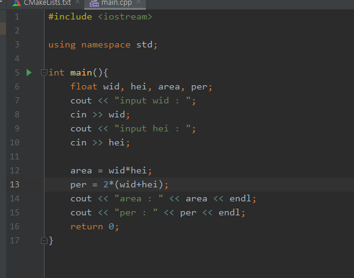
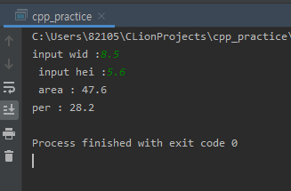

#### 40.

***

***

- 풀이과정
  1. 직사각형의 가로를 정한다.
  2. 높이를 정한다.
  3. 정한 가로와 높이를 이용하여 넓이를 구한다.
  4. 정한 가로와 높이를 이용하여 둘레를 구한다.

***

**source**

**result**

***

| 이름 | 자료형 | 사용목적     |
| ---- | ------ | ------------ |
| wid  | float  | 가로 값 저장 |
| hei  | float  | 높이 값 저장 |
| area | float  | 넓이값 저장  |
| per  | float  | 둘레값 저장  |

