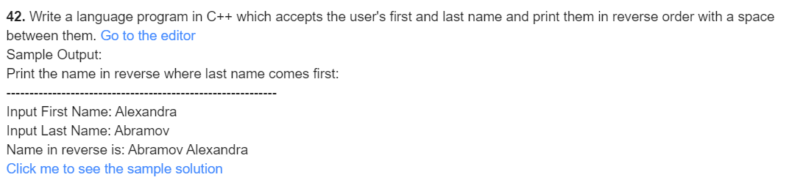
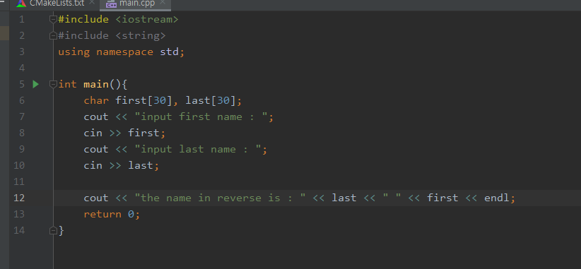
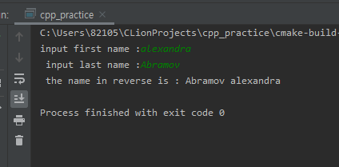

### 42

***

- 풀이과정
  1. 이름의 성을 정한다.
  2. 나머지 이름을 정한다.
  3. 나머지 이름을 먼저 보여준 후 성을 보여준다.

***

**source**

***

**result**

***

| 이름  | 자료형 | 사용목적         |
| ----- | ------ | ---------------- |
| first | char[] | 성 입력          |
| last  | char[] | 나머지 이름 입력 |

