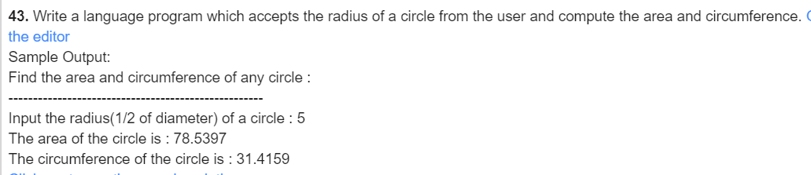
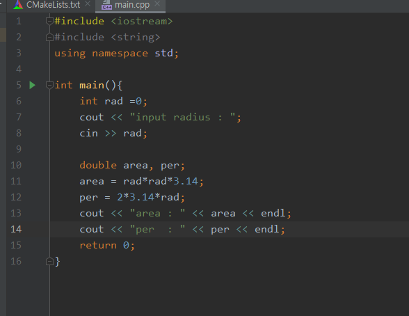
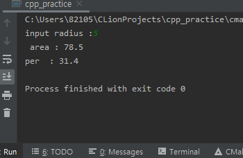

#### 43

***

- 풀이과정
  1.  반지름을 정한다.
  2.  정한 반지름으로 원의 넓이를 구한다.
  3.  정한 반지름으로 원의 둘레를 구한다.

***

**source**

***

**result**

***

| 이름 | 자료형 | 사용목적     |
| ---- | ------ | ------------ |
| rad  | int    | 반지름 저장  |
| area | double | 원 넓이 저장 |
| per  | double | 원 둘레 저장 |

