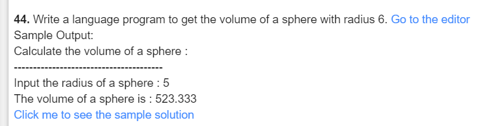
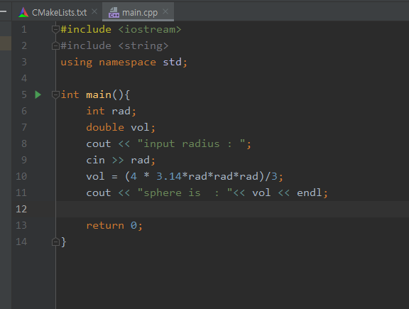
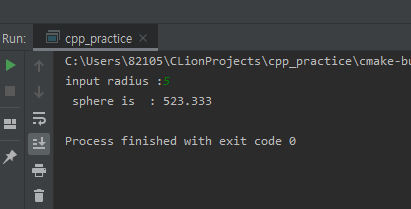

#### 44

***

- 풀이과정
  1. 실린더의 반지름을 구한다.
  2. 구한 반지름의 부피를 구한다.

***

***

***

| 이름 | 자료형 | 사용목적      |
| ---- | ------ | ------------- |
| rad  | int    | 반지름 구하기 |
| vol  | double | 부피 구하기   |

