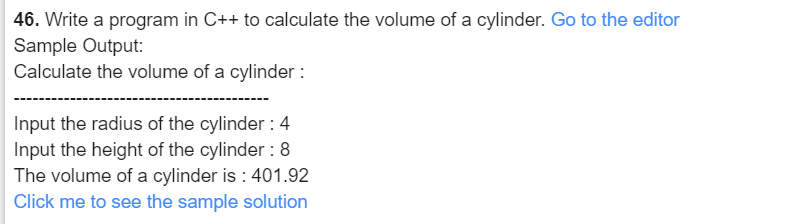
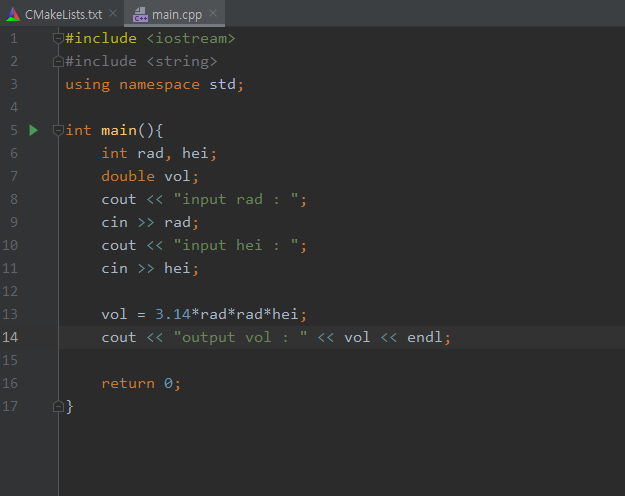
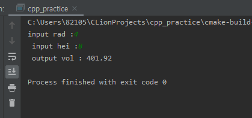

#### 46

***

- 풀이과정
  1. 반지름을 정한다.
  2. 높이를 정한다.
  3. 정한 값으로 실린더의 부피를 구한다.

***

***

| 이름 | 변수   | 사용목적    |
| ---- | ------ | ----------- |
| rad  | int    | 반지름      |
| hei  | int    | 높이        |
| vol  | double | 실린더 부피 |

