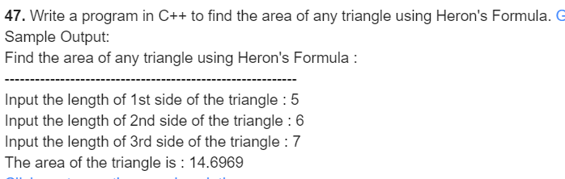
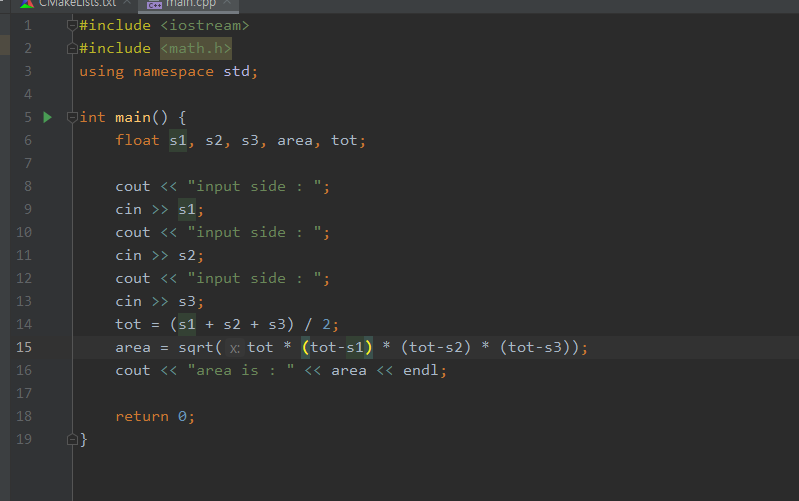
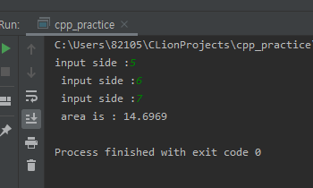

#### 47

***

- 풀이과정
  1. 새 변의 길이를 구한다.
  2. 둘레를 구한후 넓이를 구한다.

***

***

| 이름 | 변수명 | 사용목적 |
| ---- | ------ | -------- |
| s1   | float  | 변길이   |
| s2   | float  | 변길이   |
| s3   | float  | 변길이   |
| area | float  | 넓이     |
| tot  | float  | 둘레     |

