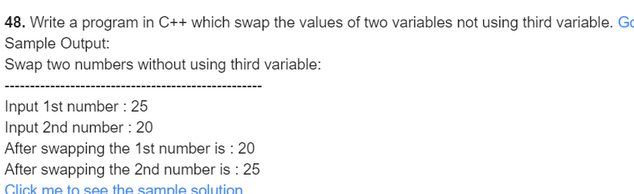
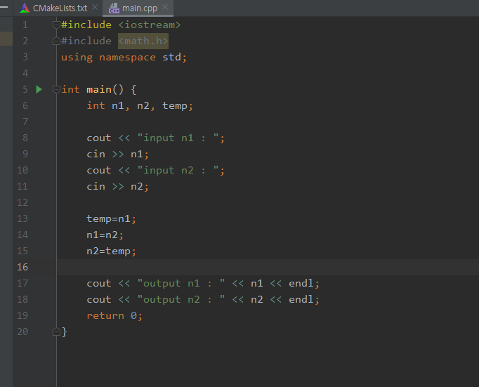
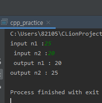

#### 48

***

- 풀이과정
  1. 첫번쨰 숫자 정한다.
  2. 두번쨰 숫자정한다.
  3. 두 숫자를 스와핑 한다.

***

| 이름 | 변수명 | 사용목적    |
| ---- | ------ | ----------- |
| n1   | int    | 1번값 저장  |
| n2   | int    | 2번값 저장  |
| temp | int    | 스와핑 변수 |

