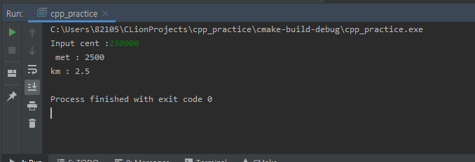

#### 50

***

- 풀이과정
  1. 거리를 구한다
  2. 거리에 대한 미터를 구한다
  3. 거리에 대한 키로미터를 구한다.

***

| 이름 | 변수  | 사용목적 |
| ---- | ----- | -------- |
| cent | float | 센티미터 |
| met  | float | 미터     |
| km   | float | 키로미터 |

