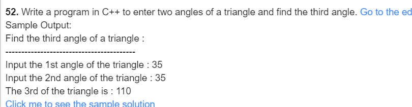
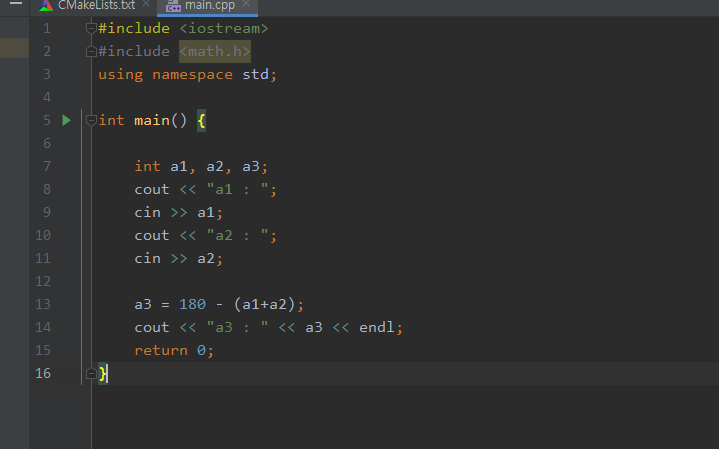
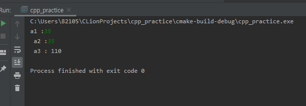

### 52

- 풀이과정
  1. 두 각도를 구한다.
  2. 정한 두 각도로 남은 각도를 구한다.

***

| 이름 | 변수 | 사용목적    |
| ---- | ---- | ----------- |
| a1   | int  | 각도1       |
| a2   | int  | 각도2       |
| a3   | int  | 나머지 각도 |

