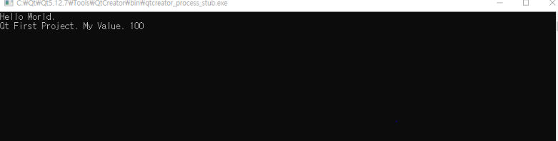
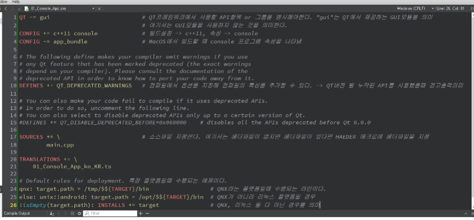
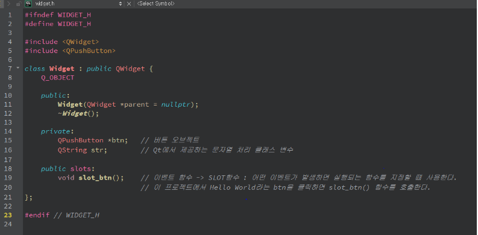
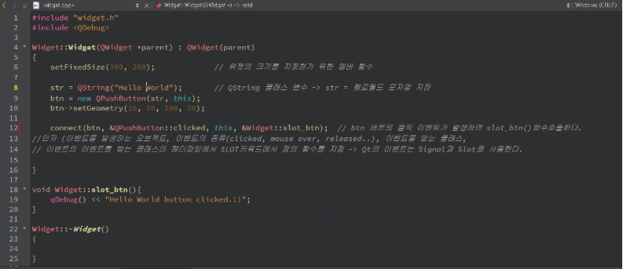
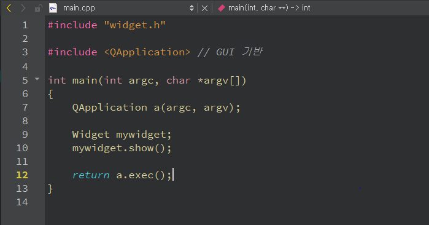

### 실습 진행 상황 -> page 30

***

- 개발 환경 : window 10
- 컴파일러 : MinGW 64bit
- 개발 툴    : Qt Creator 4.11.0

_콘솔기반 Hello World - page 20_

**source code**

***

**result**

***

_.pro파일 - page 23_

***

_GUI 기반 hello world - page 29_

**source code**

widget.h

***

widget.cpp

***

main.cpp

***

**result**

