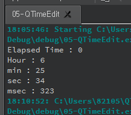

### 05-QTimeEdit

***

widget.h

```c++
#ifndef WIDGET_H
#define WIDGET_H

#include <QWidget>
#include <QTime>
#include <QTimeEdit>
#include <QLabel>

class widget : public QWidget
{
    Q_OBJECT

public:
    widget(QWidget *parent = nullptr);
    ~widget();

};
#endif // WIDGET_H

```

***

widget.cpp

```c++
#include "widget.h"

widget::widget(QWidget *parent)
    : QWidget(parent)
{
    QTimeEdit *qte[10];

    QTime ti1 = QTime(6, 24, 0, 0); // hour, min, sec, millisecond

    qte[0] = new QTimeEdit(ti1, this); // GUI 표시해주는 QTimeEdit 위젯클래스 객체생성
    qte[0]->setGeometry(10, 30, 150, 30);

    QTime t;
    t = ti1.addSecs(70);
    qte[1] = new QTimeEdit(t, this);
    qte[1]->setGeometry(10, 70, 150, 30);

    qte[2] = new QTimeEdit(t, this);
    qte[2]->setGeometry(10, 110, 150, 30);

    QTime ti2 = QTime::currentTime(); // 시스템 현재시간 저장 

    qte[4] = new QTimeEdit(ti2.currentTime(), this);
    qte[4]->setGeometry(10, 150, 150, 30);

    QTime ti3;
    ti3.start();
    // start() 선언 시점 부터 elapsed() 호출 라인까지 처리하는데 경과 시간을 얻어오는 함수 
        
    qDebug("Elapsed Time : %d", ti3.elapsed());

    QTime ti4 = QTime::fromString("03:32", "hh:mm");

    QLabel *lbl_fromString = new QLabel(ti4.toString(), this);
    lbl_fromString->setGeometry(10, 190, 150, 30);

    QTime ti5 = QTime(6, 25, 34, 323);
    qDebug("Hour : %d", ti5.hour());
    qDebug("min : %d", ti5.minute());
    qDebug("sec : %d", ti5.second());
    qDebug("msec : %d", ti5.msec());

    QTime ti6 = QTime(7, 10, 23, 122);
    QLabel *lbl_toString = new QLabel(ti6.toString("AP hh:mm:ss:zzz"), this);
        // AP : 오전/오후를 표시하는 대문자 표시 
        // ap : 소문자 표시 
    lbl_toString->setGeometry(10, 10, 150, 30);

}

widget::~widget()
{
}


```

***

**result**




