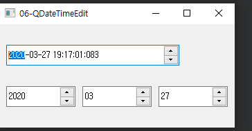

## 06-QDateTimeEdit

widget.h

```c++
#ifndef WIDGET_H
#define WIDGET_H

#include <QWidget>
#include <QDateTime>
#include <QDateTimeEdit>

class widget : public QWidget
{
    Q_OBJECT

public:
    widget(QWidget *parent = nullptr);
    ~widget();
};
#endif // WIDGET_H

```

widget.cpp

```c++
#include "widget.h"

widget::widget(QWidget *parent)
    : QWidget(parent)
{
    QDateTimeEdit *qde1;
    qde1 = new QDateTimeEdit(QDateTime::currentDateTime(), this);
    qde1->setDisplayFormat("yyyy-MM-dd hh:mm:ss:zzz");
    qde1->setGeometry(10,30,250,30);

    QDateTimeEdit *qde[3];

    qde[0] = new QDateTimeEdit(QDate::currentDate(), this);
    qde[0]->setMinimumDate(QDate::currentDate().addYears(-10));
    qde[0]->setMaximumDate(QDate::currentDate().addYears(10));
    qde[0]->setDisplayFormat("yyyy");
    qde[0]->setGeometry(10,90,100,30);

    qde[1] = new QDateTimeEdit(QDate::currentDate(), this);
    qde[1]->setDisplayFormat("MM");
    qde[1]->setGeometry(120,90,100,30);

    qde[2] = new QDateTimeEdit(QDate::currentDate(), this);
    qde[2]->setDisplayFormat("dd");
    qde[2]->setGeometry(230,90,100,30);
}

widget::~widget()
{
}


```

main.cpp

```c++
#include "widget.h"

#include <QApplication>

int main(int argc, char *argv[])
{
    QApplication a(argc, argv);
    widget w;
    w.show();
    return a.exec();
}

```

**Result**




