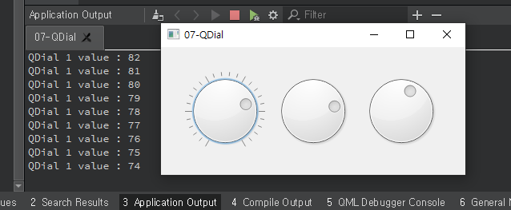

## 07-QDial

widget.h

```c++
#ifndef WIDGET_H
#define WIDGET_H

#include <QWidget>
#include <QDial>

class widget : public QWidget
{
    Q_OBJECT

public:
    widget(QWidget *parent = nullptr);
    ~widget();
private:
    QDial *dial[3];

private slots:
    void changedData();

};
#endif // WIDGET_H

```

widget.cpp

```c++
#include "widget.h"

widget::widget(QWidget *parent)
    : QWidget(parent)
{
    int xpos = 30;

    for(int i=0; i<3; i++, xpos += 110){
        dial[i] = new QDial(this);
        dial[i]->setRange(0, 100); // QDial 위젯의 범위를 지정할 수 있다.
        dial[i]->setGeometry(xpos, 30, 100, 100);
    }

    dial[0]->setNotchesVisible(true); // 위젯의 눈금을 표시할 수 있는 기능 
    connect(dial[0], &QDial::valueChanged, this, &widget::changedData);
							 // 마우스로 드래그시 시그널을 등록해 변경한 QDial의 현재값을 얻음 
}

void widget::changedData(){
    qDebug("QDial 1 value : %d", dial[0]->value());
}

widget::~widget()
{
}


```


main.cpp

```c++
#include "widget.h"

#include <QApplication>

int main(int argc, char *argv[])
{
    QApplication a(argc, argv);
    widget w;
    w.show();
    return a.exec();
}

```


**result**

