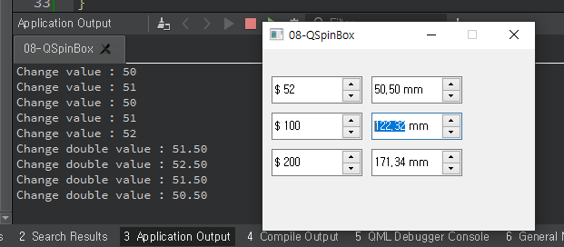

## 08-QSpinBox

widget.h

```c++
#ifndef WIDGET_H
#define WIDGET_H

#include <QWidget>
#include <QSpinBox>
#include <QDoubleSpinBox>

class Widget : public QWidget
{
    Q_OBJECT

public:
    Widget(QWidget *parent = nullptr);
    ~Widget();

private:
    QSpinBox *spin[3];
    QDoubleSpinBox *doublespin[3];

private slots:
    void valueChange();
    void double_valueChange();
};
#endif // WIDGET_H

```


widget.cpp

```c++
#include "widget.h"

Widget::Widget(QWidget *parent) : QWidget(parent)
{
    setFixedSize(300, 200);
    int ypos = 30;
    int val[3] = {50, 100, 200};
    double double_val[3] = {50.5, 127.32, 171.342};

    for(int i=0; i<3; i++){
        spin[i] = new QSpinBox(this);
        spin[i]->setMinimum(10);
        spin[i]->setMaximum(300);
        spin[i]->setValue(val[i]);
        spin[i]->setGeometry(10, ypos, 100, 30);

        doublespin[i] = new QDoubleSpinBox(this);
        doublespin[i]->setMinimum(10.0);
        doublespin[i]->setMaximum(300.0);
        doublespin[i]->setValue(double_val[i]);
        doublespin[i]->setGeometry(120, ypos, 100, 30);

       spin[i]->setPrefix("$ ");        // 앞에 "$ " 붙임
       doublespin[i]->setSuffix(" mm"); // 뒤에 " mm"붙임

       ypos += 40;
    }

    connect(spin[0], SIGNAL(valueChanged(int)), this, SLOT(valueChange()));

    connect(doublespin[0], SIGNAL(valueChanged(double)), this, SLOT(double_valueChange()));

}

void Widget::valueChange(){
    qDebug("Change value : %d", spin[0]->value());
}

void Widget::double_valueChange(){
    qDebug("Change double value : %3.2f", doublespin[0]->value());
}

Widget::~Widget()
{

}

```


main.cpp

```c++
#include "widget.h"

#include <QApplication>

int main(int argc, char *argv[])
{
    QApplication a(argc, argv);
    Widget w;
    w.show();
    return a.exec();
}

```

***

**result**



