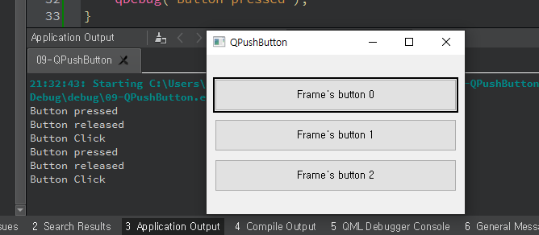

## 09 - QPushButton, QFocusFrame

widget.h

```c++
#ifndef WIDGET_H
#define WIDGET_H

#include <QWidget>
#include <QPushButton>
#include <QFocusFrame>

class Widget : public QWidget
{
    Q_OBJECT

public:
    Widget(QWidget *parent = nullptr);
    ~Widget();

private slots:
    void btn_click();
    void btn_pressed();
    void btn_released();

};
#endif // WIDGET_H

```


widget.cpp

```c++
#include "widget.h"

Widget::Widget(QWidget *parent)
    : QWidget(parent)
{
    setWindowTitle("QPushButton");

    QPushButton *btn[3];
    int ypos = 30;

    for(int i=0; i<3; i++){
        btn[i] = new QPushButton(QString("Frame's button %1").arg(i), this);
        btn[i]->setGeometry(10,ypos,300,40);
        ypos += 50;
    }

    connect(btn[0], &QPushButton::clicked, this, &Widget::btn_click);
    connect(btn[0], &QPushButton::pressed, this, &Widget::btn_pressed);
    connect(btn[0], &QPushButton::released, this, &Widget::btn_released);

    QFocusFrame *btn_frame = new QFocusFrame(this);
    btn_frame->setWidget(btn[0]);
    btn_frame->setAutoFillBackground(true);
}


void Widget::btn_click(){
    qDebug("Button Click");
}

void Widget::btn_pressed(){
    qDebug("Button pressed");
}

void Widget::btn_released(){
    qDebug("Button released");
}

Widget::~Widget()
{
}


```


main.cpp

```c++
#include "widget.h"

#include <QApplication>

int main(int argc, char *argv[])
{
    QApplication a(argc, argv);
    Widget w;
    w.show();
    return a.exec();
}

```


***

**result**



