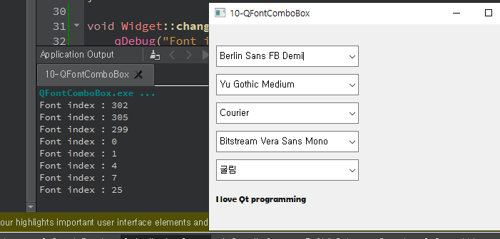

## 10 - QFontComboBox

widget.h

```c++
#ifndef WIDGET_H
#define WIDGET_H

#include <QWidget>
#include <QFontComboBox>
#include <QLabel>

class Widget : public QWidget
{
    Q_OBJECT

public:
    Widget(QWidget *parent = nullptr);
    ~Widget();

private:
    QLabel *lbl;

private slots:
    void changedIndex(int idx);
    void changedFont(const QFont &f);

};
#endif // WIDGET_H

```


widget.cpp

```c++
#include "widget.h"

Widget::Widget(QWidget *parent)
    : QWidget(parent)
{
    QFontComboBox *fontcombo[5];
    for(int i = 0 ; i < 5 ; i++){
        fontcombo[i] = new QFontComboBox(this);

        fontcombo[0]->setFontFilters(QFontComboBox::AllFonts);
        fontcombo[1]->setFontFilters(QFontComboBox::ScalableFonts);
        fontcombo[2]->setFontFilters(QFontComboBox::NonScalableFonts);
        fontcombo[3]->setFontFilters(QFontComboBox::MonospacedFonts);
        fontcombo[4]->setFontFilters(QFontComboBox::ProportionalFonts);
    }

    int ypos = 30;
    for(int i = 0 ; i < 5 ; i++) {
        fontcombo[i]->setGeometry(10, ypos, 200, 30);
        ypos += 40;
    }

    lbl = new QLabel("I love Qt programming", this);
    lbl->setGeometry(10,ypos,200,30);

    connect(fontcombo[0], SIGNAL(currentIndexChanged(int)), this, SLOT(changedIndex(int)));
    connect(fontcombo[0], SIGNAL(currentFontChanged(QFont)), this, SLOT(changedFont(const QFont &)));
}

void Widget::changedIndex(int idx){
    qDebug("Font index : %d", idx);
}

void Widget::changedFont(const QFont &f){
    lbl->setFont(f.family());
}

Widget::~Widget()
{
}


```


main.cpp

```c++
#include "widget.h"

#include <QApplication>

int main(int argc, char *argv[])
{
    QApplication a(argc, argv);
    Widget w;
    w.show();
    return a.exec();
}

```


***



