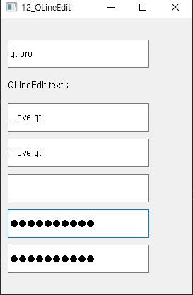

## 12-QLineEdit

widget.h

```c++
#ifndef WIDGET_H
#define WIDGET_H

#include <QWidget>
#include <QLineEdit>
#include <QLabel>

class Widget : public QWidget
{
    Q_OBJECT

public:
    Widget(QWidget *parent = nullptr);
    ~Widget();

private:
    QLineEdit *edit[5];
    QLabel *lbl;

private slots:
    void textChanged(QString str);

};
#endif // WIDGET_H

```

widget.cpp

```c++
#include "widget.h"

Widget::Widget(QWidget *parent)
    : QWidget(parent)
{
    edit[0] = new QLineEdit("", this);
    lbl = new QLabel("QLineEdit text : ", this);

    connect(edit[0], SIGNAL(textChanged(QString)), this, SLOT(textChanged(QString)));

    edit[0]->setGeometry(10,30,200,40);
    lbl->setGeometry(10,80,250,30);

    int ypos = 120;
    for(int i=0; i<5; i++){
        edit[i] = new QLineEdit("I love qt.", this);
        edit[i]->setGeometry(10, ypos, 200, 40);
        ypos += 50;
    }

    edit[1]->setEchoMode(QLineEdit::Normal);
    edit[2]->setEchoMode(QLineEdit::NoEcho);
    edit[3]->setEchoMode(QLineEdit::Password);
    edit[4]->setEchoMode(QLineEdit::PasswordEchoOnEdit);

}

void Widget::textChanged(QString str){
    lbl->setText(QString("QLineEdit Text : %1").arg(str));
}

Widget::~Widget()
{
}


```

***



