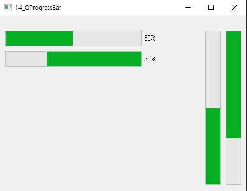

## 14_QProgressBar

widget.h

```c++
#ifndef WIDGET_H
#define WIDGET_H

#include <QWidget>
#include <QProgressBar>
#include <QLabel>

class Widget : public QWidget
{
    Q_OBJECT

public:
    Widget(QWidget *parent = nullptr);
    ~Widget();

private:
    QProgressBar *progress[4];

};
#endif // WIDGET_H

```


widget.cpp

```c++
#include "widget.h"

Widget::Widget(QWidget *parent)
    : QWidget(parent)
{
    progress[0] = new QProgressBar(this);
    progress[0]->setMinimum(0);
    progress[0]->setMaximum(100);
    progress[0]->setValue(50);
    progress[0]->setOrientation(Qt::Horizontal);

    progress[1] = new QProgressBar(this);
    progress[1]->setMinimum(0);
    progress[1]->setMaximum(100);
    progress[1]->setValue(70);
    progress[1]->setOrientation(Qt::Horizontal);
    progress[1]->setInvertedAppearance(true);

    progress[2] = new QProgressBar(this);
    progress[2]->setMinimum(0);
    progress[2]->setMaximum(100);
    progress[2]->setValue(50);
    progress[2]->setOrientation(Qt::Vertical);

    progress[3] = new QProgressBar(this);
    progress[3]->setMinimum(0);
    progress[3]->setMaximum(100);
    progress[3]->setValue(70);
    progress[3]->setOrientation(Qt::Vertical);
    progress[3]->setInvertedAppearance(true);

    progress[0]->setGeometry(10,30,300,30);
    progress[1]->setGeometry(10,70,300,30);

    progress[2]->setGeometry(400,30, 30, 300);
    progress[3]->setGeometry(440,30, 30, 300);
}

Widget::~Widget()
{
}


```


main.cpp

```c++
#include "widget.h"

#include <QApplication>

int main(int argc, char *argv[])
{
    QApplication a(argc, argv);
    Widget w;
    w.show();
    return a.exec();
}

```


***




