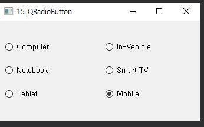

## 15_QRadioButton, QButtonGroup

- 사용자에게 여러 항목 중 하나를 선택할 수 있는 GUI제공
- Ex) 
  - On(checked) 혹은 Off(unchecked)와 같이 둘 중 하나를 선택 
  - setCheck(true) : 해당 라디오버튼 체크 표시 


widget.h

```c++
#ifndef WIDGET_H
#define WIDGET_H

#include <QWidget>
#include <QRadioButton>
#include <QButtonGroup>

class Widget : public QWidget
{
    Q_OBJECT

public:
    Widget(QWidget *parent = nullptr);
    ~Widget();

private:
    
    
};
#endif // WIDGET_H

```


widget.cpp

```c++
#include "widget.h"

Widget::Widget(QWidget *parent)
    : QWidget(parent)
{
    QRadioButton *radio1[3];
    QRadioButton *radio2[3];

    QString str1[3] = {"Computer", "Notebook", "Tablet"};

    int ypos = 30;
    for(int i=0; i<3; i++){
        radio1[i] = new QRadioButton(str1[i], this);
        radio1[i]->setGeometry(10, ypos, 150,30);
        ypos+=40;
    }

    QString str2[3] = {"In-Vehicle", "Smart TV", "Mobile"};

    ypos = 30;
    for(int i=0; i<3; i++){
        radio2[i] = new QRadioButton(str2[i], this);
        if(i==2){
            radio2[i]->setChecked(true); // TV면 체크 
        }
        radio2[i]->setGeometry(180,ypos,150,30);
        ypos+=40;
    }

    QButtonGroup *group1 = new QButtonGroup(this);
    QButtonGroup *group2 = new QButtonGroup(this);

    group1->addButton(radio1[0]);
    group1->addButton(radio1[1]);
    group1->addButton(radio1[2]);

    group2->addButton(radio2[0]);
    group2->addButton(radio2[1]);
    group2->addButton(radio2[2]);

}

Widget::~Widget()
{
}


```


***

