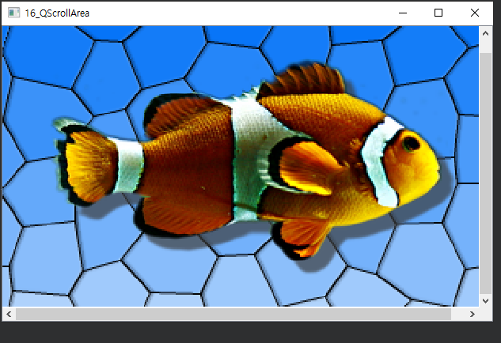

## 16_QScollArea

- 화면 또는 gui 위젯 상에 모두 표시할 수 없는 경우 스크롤 바를 이용해 가려진 부분으로 이동하는 gui 제공
- Ex)
  - 어떤 이미지를 축소하지 않고 화면에 표시하고자 할 때 Gui 위젯의 크기가 부족하게 되면 좌측 또는 하단에 스크롤이 생겨 마우스로 스크롤을 이동하면서 이미지를 볼 수 있는 것과 같은 기능을 제공한다.
  - QImage 클래스를 이용해 이미지를 QLabel 위젯상에 setPixmap()을 이용해 렌더링한다.
  - QScrollArea 위젯의 setWidget() 을이용해 QLabel 위젯을 QScrollArea 위젯 영역에 포함시킬 수 있다.


widget.h

```c++
#ifndef WIDGET_H
#define WIDGET_H

#include <QWidget>
#include <QLabel>
#include <QScrollArea>

class Widget : public QWidget
{
    Q_OBJECT

public:
    Widget(QWidget *parent = nullptr);
    ~Widget();
};
#endif // WIDGET_H

```

widget.cpp

```c++
#include "widget.h"

Widget::Widget(QWidget *parent)
    : QWidget(parent)
{
    QImage image;
    QScrollArea *area;

    QLabel *lbl = new QLabel(this);

    image = QImage(":resources/fish.png");

    lbl->setPixmap(QPixmap::fromImage(image));

    area = new QScrollArea(this);
    area->setWidget(lbl);
    area->setBackgroundRole(QPalette::Dark);

    area->setGeometry(0, 0, image.width(), image.height());
}

Widget::~Widget()
{

}

```

***



