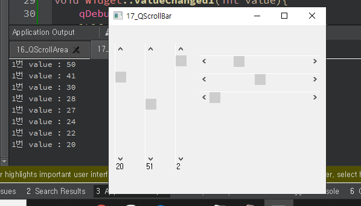

## 17_QScrollBar

- 슬라이더 위젯의 모양과 비슷하다. 
- 좌우 혹은 상하 위치 시킬 때 세로 방향 혹은 가로 방향으로 배치 할 수 있는 기능을 제공한다.
- connect( ) 함수는 vscrollbar[0] ~ vscrollbar[2] 의 값이 변경되면 각각의 Slot 함수가 호출된다. 
- 예를 들어 vscollbar[1] 번째 눈금이 마우스 드래그로 값이 변경 되면 valueChanged2( ) Slot함수가 호출된다. 이 Slot 함수는 QLabel 의 값을 Slot 함수의 인 자로 받은 값으로 변경한다. 그리고 hscrollbar[1] 의 값을 변경한다

widget.h

```c++
#ifndef WIDGET_H
#define WIDGET_H

#include <QWidget>
#include <QLabel>
#include <QScrollBar>
#include <QAbstractSlider>

class Widget : public QWidget
{
    Q_OBJECT

public:
    Widget(QWidget *parent = nullptr);
    ~Widget();

private:
    QScrollBar *vscrollbar[3];	// 세로바
    QScrollBar *hscrollbar[3];	// 가로바
    QLabel     *lbl[3];	

private slots:
    void valueChanged1(int value);
    void valueChanged2(int value);
    void valueChanged3(int value);

};
#endif // WIDGET_H

```

widget.cpp

```c++
#include "widget.h"

Widget::Widget(QWidget *parent)
    : QWidget(parent)
{
    int xpos = 10;
    int ypos = 50;
    for(int i=0; i<3; i++){
        vscrollbar[i] = new QScrollBar(Qt::Vertical, this);
        vscrollbar[i]->setRange(0, 100);
        vscrollbar[i]->setGeometry(xpos, 30, 20, 200);

        lbl[i] = new QLabel(QString("%1").arg(vscrollbar[i]->value()), this);
        lbl[i]->setGeometry(xpos+2, 220, 30, 30);
        xpos +=50;

        hscrollbar[i] = new QScrollBar(Qt::Horizontal, this);
        hscrollbar[i]->setRange(0, 100);
        hscrollbar[i]->setGeometry(150, ypos,200,20);
        ypos +=30;
    }

    connect(vscrollbar[0], SIGNAL(valueChanged(int)), this, SLOT(valueChanged1(int)));
    connect(vscrollbar[1], SIGNAL(valueChanged(int)), this, SLOT(valueChanged2(int)));
    connect(vscrollbar[2], SIGNAL(valueChanged(int)), this, SLOT(valueChanged3(int)));
//    		이벤트 객체			이벤트 								 호출함수 
}

void Widget::valueChanged1(int value){
    qDebug("1번 value : %d", value);
    lbl[0]->setText(QString("%1").arg(value));
    hscrollbar[0]->setValue(vscrollbar[0]->value()); // 세로바를 움직이면 가로바값도 바뀐다
}

void Widget::valueChanged2(int value){
    lbl[1]->setText(QString("%1").arg(value));
    hscrollbar[1]->setValue(vscrollbar[1]->value());
}

void Widget::valueChanged3(int value){
    lbl[2]->setText(QString("%1").arg(value));
    hscrollbar[2]->setValue(vscrollbar[2]->value());
}

Widget::~Widget()
{
}


```



