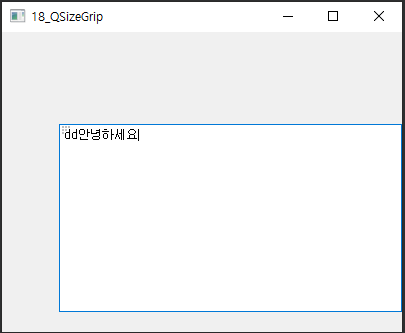

## 18_QSizeGrip 

- 한정된 크기의 윈도우 영역 안에 위젯의 크기를 조절 할 수있다.

- 예를 들어 윈도 탐색기와 같이 왼쪽에는 트리영역, 오른쪽은 파일 및 디렉토리 속성을 보여주는 gui 상에서 트리영역의 경계선을 마우스로 드래그하여 줄이거나 늘릴 수 있는 것처럼 QSizeGrip을 이용하면 Splitter와 같은 gui 를 구현할수 있다.

- QVBoxLayout 클래스: 수직 방향의 레이아웃을 이용해 위젯 배치 가능 (SubWindow의 레이아웃으로 선언)

- QTextEdit 클래스 : 메모장과 같이 텍스트를 편집하기 위해 제공되는 위젯이다. 

  (SubWindow 영역의 전체 영역 크기로 설정해 Sub 윈도우 크기를 변경할 때 동적으로 크기가 변경 할수있다)


widget.h

```c++
#ifndef WIDGET_H
#define WIDGET_H

#include <QWidget>
#include <QSizeGrip>
#include <QBoxLayout>
#include <QTextEdit>
#include <QSplitter>

// Widget 윈도우의 자식 윈도우위젯 : SubWindow 클래스 위젯
class SubWindow : public QWidget{
    Q_OBJECT

public:
    SubWindow(QWidget * parent = nullptr) : QWidget(parent, Qt::SubWindow){
        QSizeGrip *sizegrip = new QSizeGrip(this);
        sizegrip->setFixedSize(sizegrip->sizeHint());

        this->setLayout(new QVBoxLayout);
        this->layout()->setMargin(0);

        layout()->addWidget(new QTextEdit);

        sizegrip->setWindowFlags(Qt::WindowStaysOnTopHint);
        sizegrip->raise();
    }

    QSize sizeHint() const{
        return QSize(200, 100);
    }

};

// Widget 클래스 위젯, SubWindow의 부모 클래스 위젯
class Widget : public QWidget
{
    Q_OBJECT

public:
    Widget(QWidget *parent = nullptr);
    ~Widget();
};
#endif // WIDGET_H

```

```c++
#include "widget.h"

#include <QApplication>

int main(int argc, char *argv[])
{
    QApplication a(argc, argv);
    Widget w;
    w.resize(400, 300);

    SubWindow subWindow(&w);
    subWindow.move(200, 100);
    w.show();
    return a.exec();
}

```

***



