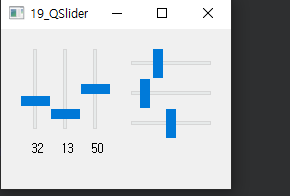

## 19_QSlider (page 61 ~ )

- 최소값과 최대값을 지정한 범위 내에서 설정 값을 변경할 수 있는 gui 제공 - QScrollBar와 유사 
- setMinimum(), setMaximum() 사용하여 범위 지정
- setRange(최소값, 최대값) : 범위지정


widget.h

```c++
#ifndef WIDGET_H
#define WIDGET_H

#include <QWidget>
#include <QSlider>

class Widget : public QWidget
{
    Q_OBJECT

public:
    Widget(QWidget *parent = nullptr);
    ~Widget();

private:
    QSlider *slider[6];
    QLabel *lbl[3];

private slots:
    void valueChanged1(int value);
    void valueChanged2(int value);
    void valueChanged3(int value);

};
#endif // WIDGET_H

```

widget.cpp

```c++
c#include "widget.h"

Widget::Widget(QWidget *parent)
    : QWidget(parent)
{
    int xpos = 20, ypos = 20;
    for(int i=0; i<6; i++){
        if(i <= 2){ // 0 1 2 수직
            slider[i] = new QSlider(Qt::Vertical, this); // 수직방향의 QSlider 객체생성
            slider[i]->setGeometry(xpos,20,30,80);
            xpos += 30;
        } else if(i >= 3){ // 3 4 5 수평
            slider[i] = new QSlider(Qt::Horizontal, this);
            slider[i]->setGeometry(130,ypos,80,30);
            ypos += 30;
        }

        slider[i]->setRange(0, 100);
        slider[i]->setValue(50); // 기본값 50 지정
    }

    xpos = 20;
    for(int i=0; i<3; i++){
        lbl[i] = new QLabel(QString("%1").arg(slider[i]->value()), this);
        lbl[i]->setGeometry(xpos+10, 100, 30, 40);
        xpos += 30;
    }

    connect(slider[0], SIGNAL(valueChanged(int)), this, SLOT(valueChanged1(int)));
    connect(slider[1], SIGNAL(valueChanged(int)), this, SLOT(valueChanged2(int)));
    connect(slider[2], SIGNAL(valueChanged(int)), this, SLOT(valueChanged3(int)));
}

void Widget::valueChanged1(int value){
    lbl[0]->setText(QString("%1").arg(value)); // 변하는 라벨값 넣기 -> QString("%인자갯수").arg(변수인자)
    slider[3]->setValue(slider[0]->value());
}
void Widget::valueChanged2(int value){
    lbl[1]->setText(QString("%1").arg(value));
    slider[4]->setValue(slider[1]->value());
}
void Widget::valueChanged3(int value){
    lbl[2]->setText(QString("%1").arg(value));
    slider[5]->setValue(slider[2]->value());
}
Widget::~Widget()
{
}


```

