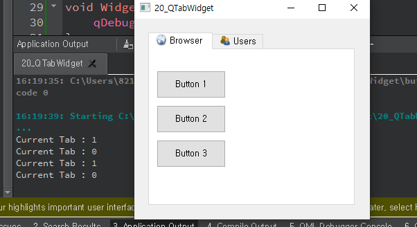

## 20_QTabWidget

- 많은 위젯을 배치할 경우 또는 윈도우의 크기가 제한적일 때 탭을 사용하면 유용하다 
- QTabWidget은 제한된 크기에 모든 탭을 표시할 수 없을 경우 동적으로 페이지를 이동할 수 있는 기능을 제공한다.
- QWidget으로 선언한 위젯을 tab 인스턴스 위젯 상에 배치하기 위해 addTab() 멤버함수를 사용한다.
- 각 탭 상에 위젯을 배치하는 방법은 위젯을 배치하기 위해 부모클래스를 인자로 명시한 것처럼 부모클래스를 탭 위젯으로 명시하면 그 위젯이 해당탭 내에 위젯을 배치 할 수 있다.


widget.h

```c++
#ifndef WIDGET_H
#define WIDGET_H

#include <QWidget>
#include <QTabWidget>
#include <QPushButton>

class Widget : public QWidget
{
    Q_OBJECT

public:
    Widget(QWidget *parent = nullptr);
    ~Widget();

private slots:
    void currentTab(int value);


};
#endif // WIDGET_H

```

widget.cpp

```c++
#include "widget.h"

Widget::Widget(QWidget *parent)
    : QWidget(parent)
{
    QTabWidget *tab = new QTabWidget(this); // 탭 생성

    QWidget *browser_tab = new QWidget();  // 다형성
    QWidget *users_tab = new QWidget;

    tab->addTab(browser_tab, QIcon(":resources/browser.png"), "Browser"); // 브라우저 탭 추가
    tab->addTab(users_tab, QIcon(":resources/users.png"), "Users"); // 유저 탭추가

    tab->setGeometry(20, 20, 300, 250);

    QString btn_str[3] = {"Button 1", "Button 2", "Button 3"}; // 버튼 목록 이름 초기화
    QPushButton *btn[3];

    int ypos = 30;
    for(int i=0; i<3; i++){
        btn[i] = new QPushButton(btn_str[i], browser_tab); // 버튼 생성
        btn[i]->setGeometry(10, ypos, 100, 40);
        ypos += 50;
    }

    connect(tab, SIGNAL(currentChanged(int)), this, SLOT(currentTab(int))); // 탭 목록 이동시 currentTab호출

    connect(btn[0], SIGNAL(clicked()), this, SLOT(valueChanged1()));
    connect(btn[1], SIGNAL(clicked()), this, SLOT(valueChanged2()));
    connect(btn[2], SIGNAL(clicked()), this, SLOT(valueChanged3()));

}

void Widget::currentTab(int value){
    qDebug("Current Tab : %d", value);
}

void Widget::valueChanged1(){
    qDebug("Button 1 select");
}

void Widget::valueChanged2(){
    qDebug("Button 2 select");
}

void Widget::valueChanged3(){
    qDebug("Button 3 select");
}
Widget::~Widget()
{
}


```


