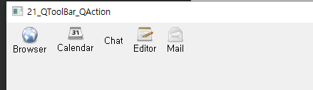

## 21. QToolBar, QAction

- QToolBar

  - 윈도우 상에 툴메뉴 바와 같은 GUI 제공

  - addAction

    - 툴바 메뉴 상에 배치 가능하다.

  - setToolButtonStyle() 주요 인자들 -> 툴바 모양 표시해준다

    | 상수                        | 값   | 설명                        |
    | --------------------------- | ---- | --------------------------- |
    | Qt::ToolButtonIconOnly      | 0    | 아이콘만 표시               |
    | Qt:ToolButtonTextOnly       | 1    | 버튼 이름만 표시            |
    | Qt:ToolButtonTextBesideIcon | 2    | 아이콘을 텍스트 안쪽에 표시 |
    | Qt:ToolButtonTextUnderIcon  | 3    | 아이콘을 텍스트 위에 표시   |

  - setShortcut() : ?

  - setToolTip() : 마우스 대면 글자 표시 

    

widget.h

```c++
#ifndef WIDGET_H
#define WIDGET_H

#include <QWidget>
#include <QAction>
#include <QToolBar>

class Widget : public QWidget
{
    Q_OBJECT

public:
    Widget(QWidget *parent = nullptr);
    ~Widget();

private slots:
    void trigger1();
    void trigger2();
    void trigger3();
    void trigger4();
    void trigger5();

};
#endif // WIDGET_H

```

widget.cpp

```c++
#include "widget.h"

Widget::Widget(QWidget *parent)
    : QWidget(parent)
{
    QToolBar *toolbar = new QToolBar(this);
    QAction *act[5];

    act[0] = new QAction(QIcon(":resources/browser.png"), "Browser", this);
    act[1] = new QAction(QIcon(":resources/calendar.png"), "Calendar", this); // 기본값
    act[2] = new QAction(QIcon(":resources/char.png"), "Chat", this);
    act[3] = new QAction(QIcon(":resources/editor.png"), "Editor", this);
    act[4] = new QAction(QIcon(":resources/mail.png"), "Mail", this);

    act[0]->setShortcut(Qt::Key_Control | Qt::Key_E); // ctrl + e
    act[0]->setToolTip("This is a ToolTip."); // 마우스 대면 글자 표시
    act[3]->setToolTip("안녕");

    //toolbar->setToolButtonStyle(Qt::ToolButtonTextBesideIcon); // 툴바 모양 표시
    //toolbar->setToolButtonStyle(Qt::ToolButtonIconOnly);
    toolbar->setToolButtonStyle(Qt::ToolButtonTextUnderIcon);

    for(int i=0; i<5; i++){
        toolbar->addAction(act[i]);
    }

    //toolbar->setGeometry(300, 100, 0, 100);

    connect(act[0], SIGNAL(triggered()), this, SLOT(trigger1()));
    connect(act[1], SIGNAL(triggered()), this, SLOT(trigger2()));
    connect(act[2], SIGNAL(triggered()), this, SLOT(trigger3()));
    connect(act[3], SIGNAL(triggered()), this, SLOT(trigger4()));
    connect(act[4], SIGNAL(triggered()), this, SLOT(trigger5()));
}

void Widget::trigger1(){
    qDebug("Tool Button 1 click.");
}
void Widget::trigger2(){
    qDebug("Tool Button 2 click.");
}
void Widget::trigger3(){
    qDebug("Tool Button 3 click.");
}
void Widget::trigger4(){
    qDebug("Tool Button 4 click.");
}
void Widget::trigger5(){
    qDebug("Tool Button 5 click.");
}

Widget::~Widget()
{
}


```



