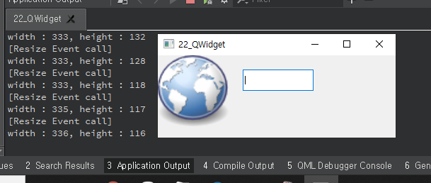

## 22_QWidget

- 마우스,  키보드 혹은 윈도우로부터 받은 이벤트를 QPushButton과 같은 위젯에서 사용할 수 있는 것도 QWidget 으로부터 상속받았기 때문에 가능하다.
- QWidget 클래스는 paintEvent() virtual 함수를 이용해 위젯 영역에 텍스트, 도형, 이미지를 랜더링 할수 있는 기능을 제공.
- QWidget 클래스의 update() 멤버함수를 호출하면 paintEvent() 함수를 호출 할 수 있다.
- Ex ) 
  - 어떤 버튼을 클릭하면 호출되는 Slot 함수내에 update() 멤버 함수를 사용하면 paintEvent() virtual 함수가 호출된다.
- resizeEvent() virtual 함수를 제공한다. 
- ```virtual 함수는 QWidget의 크기가 변경되면 호출```된다.
- QWidget 영역 내에 마우스 이벤트를 처리, 키보드 이벤트, 위젯의 영역에 활성화가 Focus 되어 있는지 등의 다양한 virtual 함수를 제공한다.


widget.h

```c++
#ifndef WIDGET_H
#define WIDGET_H

#include <QWidget>
#include <QPainter>
#include <QtEvents>
#include <QLineEdit>

class Widget : public QWidget
{
    Q_OBJECT

public:
    Widget(QWidget *parent = nullptr);
    ~Widget();

private:
    QLineEdit *edit;

protected:
    virtual void paintEvent(QPaintEvent *event);
    virtual void resizeEvent(QResizeEvent *event);

    virtual void mousePressEvent(QMouseEvent *event);
    virtual void mouseReleaseEvent(QMouseEvent *event);
    virtual void mouseDoubleClickEvent(QMouseEvent *event);
    virtual void mouseMoveEvent(QMouseEvent *event);

    virtual void keyPressEvent(QKeyEvent *event);
    virtual void keyReleaseEvent(QKeyEvent *event);
    virtual void focusInEvent(QFocusEvent *event);
    virtual void foucsOutEvent(QFocusEvent *event);

};
#endif // WIDGET_H

```

widget.cpp

```c++
#include "widget.h"

Widget::Widget(QWidget *parent)
    : QWidget(parent)
{
    edit = new QLineEdit("", this);
    edit->setGeometry(120, 20, 100, 30); // xpos, ypos, width, height
}

void Widget::paintEvent(QPaintEvent *event)
{
    Q_UNUSED(event); // 에러는 아니지만 신경쓰이는 경우 Q_UNUSED() 매크로를 써서 경고를 발생시키지 않도록 처리
    QString img_full_name;

    QPainter painter(this);

    img_full_name = QString(":resources/browser.png");

    QImage image(img_full_name);
    painter.drawPixmap(50, 20, QPixmap::fromImage(image.scaled(50, 50, Qt::IgnoreAspectRatio, Qt::SmoothTransformation)));
    // QPainter.drawPixmap(xpos, ypos, QPixmap::fromImage()) :
    // QImage.scaled(xpos, ypos, ) : 그림파일의 크기를 바꿔주는 역할
    // IgnoreAspectRatio : 그림 비율 무시
    painter.end();
}

void Widget::resizeEvent(QResizeEvent *event)
{
    Q_UNUSED(event);

    qDebug("[Resize Event call]");
    qDebug("width : %d, height : %d", this->width(), this->height());
}

void Widget::mousePressEvent(QMouseEvent *event)
{
    Q_UNUSED(event);

    qDebug("[Mouse Press] x, y : %d , %d ", event->x(), event->y());
}

void Widget::mouseReleaseEvent(QMouseEvent *event)
{
    Q_UNUSED(event);
    qDebug("[Mouse Release] x, y : %d , %d ", event->x(), event->y());
}

void Widget::mouseDoubleClickEvent(QMouseEvent *event)
{
    Q_UNUSED(event);
    qDebug("[Mouse Double Click] x, y : %d , %d ", event->x(), event->y());
}

void Widget::mouseMoveEvent(QMouseEvent *event)
{
    Q_UNUSED(event);
    qDebug("[Mouse Move] x, y : %d , %d ", event->x(), event->y());
}

void Widget::keyPressEvent(QKeyEvent *event)
{
    Q_UNUSED(event);
    qDebug("Key Press Event.");

    switch(event->key())
    {
        case Qt::Key_A :

            if(event->modifiers())
                qDebug("A");
            else
                qDebug("a");

            qDebug("%x", event->key());
            break;

        default:
            break;
    }
}

void Widget::keyReleaseEvent(QKeyEvent *event)
{
    Q_UNUSED(event);
    qDebug("Key Release Event.");
}

void Widget::focusInEvent(QFocusEvent *event)
{
    Q_UNUSED(event);
    qDebug("focusInEvent Event.");
}

void Widget::focusOutEvent(QFocusEvent *event)
{
    Q_UNUSED(event);
    qDebug("focusOutEvent Event.");
}

Widget::~Widget()
{

}

```




