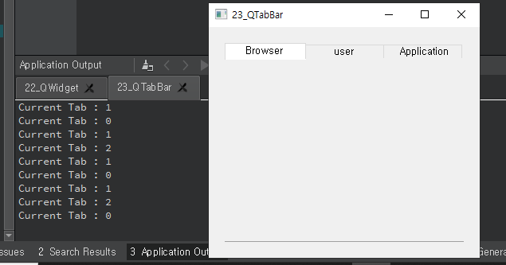

## 23_QTabBar

- QTabBar 클래스 위젯은 탭 GUI를 제공한다. 이 위젯은 QTabWidget 과 비슷한 기능을 제공한다. 
- 탭에 아이콘을 사용 하기 위해서 setTabIcon( ) 함수를 사용하면 된다. 각 탭 에 표시되는 텍스트가 구별되게 컬러 지정이 가능하다. 탭의 텍스트를 지정하기 위해 setTabTextColor( ) 함수를 사용하면 된다.
- QTabBar는 이미 정의된 탭의 모양을 변경할 수 있다. 예를 들어 모서리가 둥근 형태의 탭이나 탭의 왼쪽 모서리만 둥글게 표현한 도형을 이용할 수 있는 기능을 제공하며 setShape( ) 함수를 이용해 지정할 수 있다. 다음 표는 ENUM 타입으로 정의된 탭모양 값이다

widget.h

```c++
#ifndef WIDGET_H
#define WIDGET_H

#include <QWidget>
#include <QTabBar>

class Widget : public QWidget
{
    Q_OBJECT

public:
    Widget(QWidget *parent = nullptr);
    ~Widget();

private slots:
    void currentTab(int index);
    

};

#endif // WIDGET_H

```

widget.cpp

```c++
#include "widget.h"

Widget::Widget(QWidget *parent)
    : QWidget(parent)
{
    QTabBar *tab = new QTabBar(this);
    tab->addTab("Browser");
    tab->addTab("user");
    tab->addTab("Application");

    tab->setShape(QTabBar::RoundedNorth);
    tab->setGeometry(20,20,300,250);

    connect(tab, SIGNAL(currentChanged(int)), this, SLOT(currentTab(int)));

}

void Widget::currentTab(int index){
    qDebug("Current Tab : %d", index);
}

Widget::~Widget()
{
}


```



