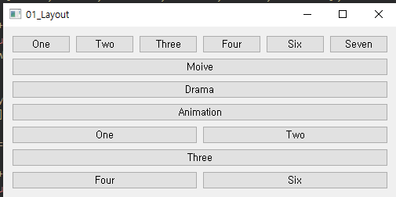

## 02-Layout - 01_Layout

- QWidget 클래스의 setGeometry() 멤버함수를 이용해 GUI 상에서 특정 X, Y 좌표로 위젯을 배치하게 되면 윈도우의 크기가 변경될 때 위젯의 위치가 변경되지 않는다. 

- 레이아웃을 이용해 위젯을 배치하면 위젯들의 크기가 변경되면 ```GUI 상에 위젯의 위치도 동적```으로 변경된다.

- 주로 사용하는 레이아웃

  | 클래스      | 설명                                    |
  | ----------- | --------------------------------------- |
  | QHBoxLayout | 위젯들을 가로 방향으로 배치             |
  | QVBoxLayout | 위젯들을 세로 방향으로 배치             |
  | QGridLayout | 위젯을 그리드 또는 바둑판 스타일로 배치 |
  | QFormLayout | 위젯을 2열로 배치하는 형식              |

widget.h

```c++
#ifndef WIDGET_H
#define WIDGET_H

#include <QWidget>
#include <QHBoxLayout>
#include <QVBoxLayout>
#include <QGridLayout>
#include <QLayout>
#include <QPushButton>

class Widget : public QWidget
{
    Q_OBJECT

public:
    Widget(QWidget *parent = nullptr);
    ~Widget();
};
#endif // WIDGET_H

```

widget.cpp

```c++
#include "widget.h"

Widget::Widget(QWidget *parent)
    : QWidget(parent)
{

    QHBoxLayout *hboxLayout = new QHBoxLayout();
    QPushButton *btn[6];

    QString btnStr[6] = {"One", "Two", "Three", "Four", "Six", "Seven"};

    for(int i=0; i<6; i++){
        btn[i] = new QPushButton(btnStr[i]);
        hboxLayout->addWidget(btn[i]);
    }

    QVBoxLayout *vboxLayout = new QVBoxLayout();
    QPushButton *vbtn[6];

    QString vbtnStr[3] = {"Moive", "Drama", "Animation"};

    for(int i=0; i<3; i++){
        vbtn[i]= new QPushButton(vbtnStr[i]);
        vboxLayout->addWidget(vbtn[i]);
    }

    QGridLayout *gridLayout = new QGridLayout();
    QPushButton *gbtn[5];

    for(int i=0; i<5; i++){
        gbtn[i] = new QPushButton(btnStr[i]);
    }

    gridLayout->addWidget(gbtn[0], 0, 0);
    gridLayout->addWidget(gbtn[1], 0, 1);
    gridLayout->addWidget(gbtn[2], 1, 0, 1, 2);
    gridLayout->addWidget(gbtn[3], 2, 0);
    gridLayout->addWidget(gbtn[4], 2, 1);

    QVBoxLayout *defaultLayout = new QVBoxLayout();

    defaultLayout->addLayout(hboxLayout);
    defaultLayout->addLayout(vboxLayout);
    defaultLayout->addLayout(gridLayout);

    setLayout(defaultLayout);
}

Widget::~Widget() {}


```



