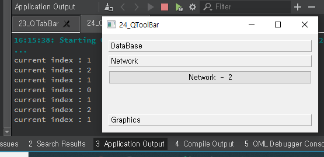

## 24_QToolBox

- 위젯 아이템들을 새로 방향 탭 컬럼 형태로 GUI를 제공한다.
- 각 탭의 이름으로 텍스트와 아이콘을 사용할 수 있다.

widget.h

```c++
#ifndef WIDGET_H
#define WIDGET_H

#include <QWidget>
#include <QToolBox>
#include <QHBoxLayout>
#include <QPushButton>

class Widget : public QWidget
{
    Q_OBJECT

public:
    Widget(QWidget *parent = nullptr);
    ~Widget();

private:
    QToolBox *box;
    QHBoxLayout *lay;
    QPushButton *but1;
    QPushButton *but2;
    QPushButton *but3;

private slots:
    void changeTab(int index);
};
#endif // WIDGET_H

```

widget.cpp

```c++
#include "widget.h"

Widget::Widget(QWidget *parent)
    : QWidget(parent)
{
    box = new QToolBox(this);
    lay = new QHBoxLayout(this);

    but1 = new QPushButton("DataBase  -  1", this);
    but2 = new QPushButton("Network  -  2", this);
    but3 = new QPushButton("Graphics  -  3", this);

    box->addItem(but1, "DataBase");
    box->addItem(but2, "Network");
    box->addItem(but3, "Graphics");

    lay->addWidget(box);
    setLayout(lay);

    connect(box, SIGNAL(currentChanged(int)), this, SLOT(changedTab(int)));
}

void Widget::changedTab(int index){
    qDebug("current index : %d", index);
}

Widget::~Widget()
{
}


```



