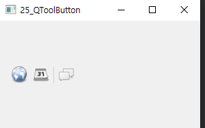

## 25_QToolButton

- 텍스트 또는 아이콘을 사용해 버튼과 같은 기능을 제공 한다.
- 아이콘은 QIcon 클래스를 이용해 지정할 수 있다. 
- 아이콘은 상태에 따라 활성화 or 비활성화된 상태로 표시 할 수 있으며 비활성화 상태에서는 버튼을 사용 할 수 없다.
- setToolButtonStyle() : 스타일 변경 
- setIConSize() : 아이콘의 크기 지정

widget.cpp

```c++
#include "widget.h"

#include <QToolButton>
#include <QToolBar>
#include <QVBoxLayout>
#include <QIcon>

Widget::Widget(QWidget *parent)
    : QWidget(parent)
{
    QToolBar *tool = new QToolBar(this);
    QVBoxLayout *layout = new QVBoxLayout;

    QToolButton *button = new QToolButton;
    button->setIcon(QIcon(":resources/resources/browser.png"));

    QToolButton *button1 = new QToolButton;
    button1->setIcon(QIcon(":resources/resources/calendar.png"));

    QToolButton *button2 = new QToolButton;
    button2->setIcon(QIcon(":resources/resources/chat.png"));

    tool->addWidget(button);
    tool->addWidget(button1);
    tool->addSeparator();
    tool->addWidget(button2);
    layout->addWidget(tool);

    this->setLayout(layout);
}

Widget::~Widget()
{
}


```



