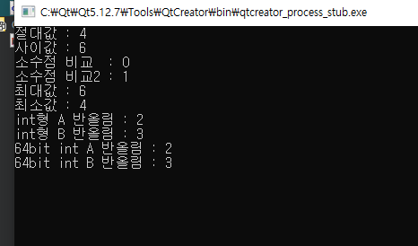
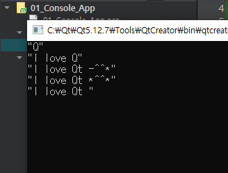
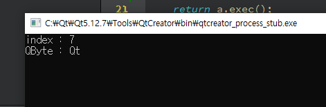
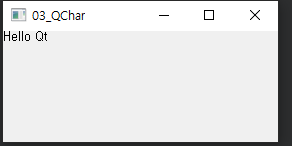
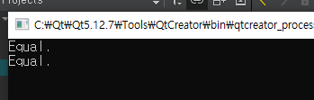
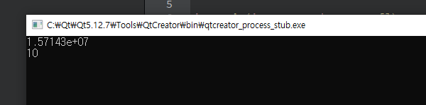
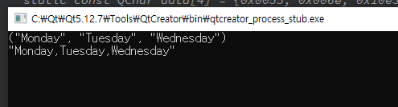

### Qt 에서 제공하는 데이터 타입과 클래스 (page 80 ~ 87)

- Qt는 개발자의 편의성을 위해 다양한 데이터 타입을 제공한다.

  - Ex) 

    - QString과 같은 문자열 내에 특정 패턴을 찾아내기 위해 정규식 표현을 지원하거나 문자열에 특정 문자를 추가하거나 삭제 등 다양한 기능을 제공한다.

      

- Qt에서는 ``이기 종간의 데이터 교환 시 데이터 타입의 변화로 생기는 문제를 해결``하기위한 데이터 타입도 지원한다. 

  - Ex)

    - 우분투 리눅스 운영체제상에서 Qt로 개발한 어플리케이션 내에 "Hello World" 라는 문자열을 Qt에서 제공하는 QString 이라는 문자열을 전송한다.
    - 그리고 이 문자열을 수신 받는 측에서는 MS윈도우 운영체제상에서 Visual C++로 개발하여 "Hello World" 문자열을 CString 문자열을 저장한다면 두 개의 데이터가 다른 데이터가 저장된다.
    - QString -> CString 
    - 이 기종 간의 문제를 해결하기 위해서 ```QString을 QByteArray로 변환```해 전송하면 수신 받는 측에서 ```Char``` 형으로 사용할 수 있기 때문에 이기종 간의 데이터 문제를 해결할 수 있다. 
    - 또한 Qt는 QVariant 데이터 타입과 같이 void형 데이터 타입도 지원한다. 

  - ```<표>``` 기본 데이터 타입 

    - | 타입        | 크기  | 설명                                           |
      | ----------- | ----- | ---------------------------------------------- |
      | bool        | 8bit  | true / false                                   |
      | qint8       | 8bit  | signed char                                    |
      | qint16      | 16bit | signed short                                   |
      | qint32      | 32bit | signed int                                     |
      | qint64      | 64bit | long long int                                  |
      | quint8      | 8bit  | unsigned char                                  |
      | quint16     | 16bit | unsigned short                                 |
      | quint32     | 32bit | unsigned int                                   |
      | quint64     | 64bit | unsigned long long int                         |
      | float       | 32bit | IEEE 754 포맷을 사용하는 floating point number |
      | double      | 64bit | IEEE 754 포맷을 사용하는 floating point number |
      | const char* | 32bit | 문자열 상수를 가르키는 포인터, 마지막에 0 제외 |

  

- Qt는 데이터 타입의 값을 판단/비교하기 위한 일반 함수와 템플릿 함수를 제공한다.

  - EX) 
    - 절대값을 구하기 위해 qAbs(), 최대/최소 사이값을 구하기위해 qBound(), 최소값을 구하기 위한 qMin(), 최대값을 구하기 위한 qMax() 함수 등을 제공한다.

  

- source :  데이터 타입 클래스 

- [qDebug](https://doc.qt.io/qt-5/qtglobal.html#qDebug)() is used for writing custom debug output.

- [qInfo](https://doc.qt.io/qt-5/qtglobal.html#qInfo)() is used for informational messages.

- [qWarning](https://doc.qt.io/qt-5/qtglobal.html#qWarning)() is used to report warnings and recoverable errors in your application.

- [qCritical](https://doc.qt.io/qt-5/qtglobal.html#qCritical)() is used for writing critical error messages and reporting system errors.

- [qFatal](https://doc.qt.io/qt-5/qtglobal.html#qFatal)() is used for writing fatal error messages shortly before exiting.

```c++
#include <QCoreApplication>
#include <QDebug>

int divide(int a, int b){
    if(b==0){
        qFatal("divide : cannot divide by zero"); // 다른 디버깅 메시지와 다르게 프로그램 종료
    }
    return a / b;
}

int main(int argc, char *argv[])
{
    QCoreApplication a(argc, argv);

    int absoluteValue;
    int myValue = -4;
    int Value = 10;
    int minValue = 2;
    int maxValue = 6;

    // 절대값 구하기
    absoluteValue = qAbs(myValue);
    qDebug("절대값 : %d", absoluteValue);

    // 최소값과 최대값 사이 구하기
    int boundedValue = qBound(minValue, Value, maxValue);
    qDebug("사이값 : %d", boundedValue);

    // 소수점 비교 함수
    qDebug("소수점 비교  : %d", qFuzzyCompare(0.0, 1.0e-200)); // return false
    qDebug("소수점 비교2 : %d", qFuzzyCompare(1 + 0.0, 1 + 1.0e-200)); // return true

    // 두수중 최대값 구하기
    myValue = 6;
    int yourValue = 4;
    qDebug("최대값 : %d", qMax(myValue, yourValue));
    qDebug("최소값 : %d", qMin(myValue, yourValue));

    // int형 반올림
    qreal valueA = 2.3;
    qreal valueB = 2.7;
    qDebug("int형 A 반올림 : %d", qRound(valueA));
    qDebug("int형 B 반올림 : %d", qRound(valueB));

    // 64bit int형 반올림
    valueA = 2.3;
    valueB = 2.7;
    qDebug("64bit int A 반올림 : %d", qRound(valueA));
    qDebug("64bit int B 반올림 : %d", qRound(valueB));


    return a.exec();
}

```



***


- 문자열 데이터 타입 클래스 

  - Qt는 단순한 문자열을 다루는 것 외에도 데이터 스트림, 멀티 바이트 캐릭터 형태의 유니코드 4.0(Unicode Standard Version) 캐릭터를 지원하는 다양한 클래스를 제공한다.

  -  ```<표>``` Qt에서 제공하는 다양한 문자열 데이터 타입 클래스

    | 클래스                    | 설명                                                         |
    | ------------------------- | ------------------------------------------------------------ |
    | QByteArray                | 바이트(8-bit) 단위의 배열을 지원하기 위한 클래스                                                   append(), prepen(), insert(), replace(), remove() |
    | QByteArrayMatcher         | QByteArray로 구현된 바이트 단위의 배열의 index를 이용해 매칭되는 문자열이 있는지 찾기 위해 사용되는 클래스 |
    | QChar                     | 16bit 유니코드 Character를 지원하기 위한 클래스              |
    | QLatin1Char QLatin1String | US-ASCII/Latin-1 인코딩 문자/문자열을 지원하기 위해 제공되는 클래스 |
    | QLocale                   | 숫자 표시 방식 혹은 문자 표시 방식을 다양한 언어의 표현 방식에 맞도록 변환하는 클래스입니다. |
    | QString                   | 유니코드 문자열 캐릭터를 지원하는 클래스                     |
    | QStringList               | 문자열 리스트의 집합 클래스                                  |
    | QStringMatcher            | 문자열 상에 매칭되는 문자열을 찾기 위해 제공되는 클래스      |
    | QStringRef                | size(), position(), toString()과 같은 서브 스트링 래핑 클래스 |
    | QTextStream               | Text 기반 Write/Read 를 위한 Stream 기능 제공                |
    | QDataStream               | Binary 기반 Write/Read 를 위한 Stream 기능 제공              |

    

-  ```QByteArray example ```
  - QByteArray -> QString 변환 후 디버깅 확인하고 싶어서 검색함 
    - [Qbytearray 디버깅 검색](https://stackoverrun.com/ko/q/3270778)

```c++
#include <QCoreApplication>
#include <QDebug>
//#include <QString>
//#include <iostream>
//using namespace std;

int main(int argc, char *argv[])
{
    QCoreApplication a(argc, argv);

    QByteArray x("Q");
    QString str = "";
    str.append(x);
    qDebug() << str;

    x.prepend("I love ");
    str = "";
    str.prepend(x);
    qDebug() << str;

    x.append("t -^^*");
    str = "";
    str.append(x);
    qDebug() << str;

    x.replace(13, 1, "*");
    str.replace(10, 1, "*");
    qDebug() << str;


    QByteArray xx("I love Qt -^^*");
    xx.remove(13, 4);
    str = "";
    str.append(xx);
    str.remove(10, 4);
    qDebug() << str;


    return a.exec();
}

```



***

- QByteArrayMatcher
  - 바이트 배열에서 매칭되는 바이트 배열 패턴을 찾기 위해 제공되는 클래스이다.
  - QByteArray 클래스변수에 찾고자하는 문자열을 집어넣은 뒤, QByteArrayMatcher 클래스 변수에 찾고자하는 QByteArray 클래스 변수를 대입한다. 
  - int 형변수에 indexIn() 멤버함수를 호출하여 index를 구해준다. 
  - 참고 사이트 : https://doc.qt.io/qt-5/qbytearraymatcher.html#indexIn

```c++
// 전체 QByteArray
QByteArray x(" hello Qt, nice top meet you.");
QByteArray y("Qt"); // x에서 찾고자 하는 바이트배열 

QByteArrayMatcher matcher(y);

// 문자열이 시작되는 위치 index 변수에 저장
int index = matcher.indexIn(x, 0); // 인자 : 원본 바이트 배열, 첫번째 바이트에서 검색 

qDebug("index : %d", index);
qDebug("QByte : %c%c", x.at(index), x.at(index+1)); // 해당인덱스 바이트배열값 반환
```




***

- QChar
  - 16 bit 유니코드 지원하기 위한 Character 클래스

```c++
#include "widget.h"

Widget::Widget(QWidget *parent)
    : QWidget(parent)
{
    QLabel *lbl = new QLabel("", this); // 라벨 초기화
    QString str = "Hello Qt";           // 라벨에 넣을 문자열
    QChar *data = str.data();
    QString str_display;

    while(!data->isNull()){
        str_display.append(data->unicode());
        ++data;
    }

    lbl->setText(str_display); // Hello Qt
}

Widget::~Widget()
{
}


```




***


- QLatin1String
  - US-ASCII/Latin-1 인코딩 문자열을 지원하기 위해 제공되는 클래스

```c++
#include <QCoreApplication>
#include <QDebug>
#include <QByteArrayMatcher>


int main(int argc, char *argv[])
{
    QCoreApplication a(argc, argv);

    QLatin1String latin("Qt");
    QString str = QString("Qt");

    if(str == latin){
        qDebug("Equal.");
    } else {
        qDebug("Not Equal.");
    }

    bool is_equal = latin.operator ==(str);

    if(is_equal){
        qDebug("Equal.");
    } else {
        qDebug("Not Equal.");
    }

    return a.exec();
}

```



***

- QLocale
  - 숫자와 문자를 다양한 언어로 변환하기 위해 사용한다.

```c++
#include <QCoreApplication>
#include <QDebug>
#include <QByteArrayMatcher>


int main(int argc, char *argv[])
{
    QCoreApplication a(argc, argv);

    QLocale egytian(QLocale::Arabic, QLocale::Egypt);
    QString s1 = egytian.toString(1.571429E+07, 'e');
    QString s2 = egytian.toString(10);

    double d = egytian.toDouble(s1);    // 실수형으로 변환
    int i = egytian.toInt(s2);          // 정수형으로 변환

    qDebug() << d;
    qDebug() << i;

    return a.exec();
}

```




***

- QString 

  - 유니코드 문자열을 지원, 16-bit QChar를 저장할 수 있는 기능 제공한다.

  - ```c++
    QString str = "Hello";
    ```

  - QString 은 Const char * 와 같은 문자열 상수를 fromUtf8() 함수를 사용해 대체할 수 있는 기능 제공 

  - ```c++
    static const QChar data[4] = {0x0055, 0x006e, 0x10e3, 0x03a3};
    QString str(data, 4);
    ```

    

  - 저장된 문자열의 특정위치에 QChar 을 저장할 수 있는 기능 제공

  - ```c++
    QString str;
    str.resize(4);
    str[0] = QChar('U');
    str[1] = QChar('n');
    str[2] = QChar(0x10e3);
    str[3] = QChar(0x03a3);
    ```

    

  - 문자열을 비교하기 위해 QString은 if 문을 이용해 다음과 같은 비교가 가능하다.

  - ```c++
    QString str;
    if(str == "auto" || str == "extern" || str == "static" || str == "register"){
        // ...
    }
    ```

    

  - 찾고자 하는 특정 문자열의 위치를 알고 싶다면 indexOf() 함수를 사용

  - ```c++
    QString str = "We must be <b>bold</b>, very <b>bold</b>";
    int j=0;
    whlie((j == str.indexOf("<b>", j)) != -1){
        qDebug() << "Found <b> tag at index position" << j;
        ++j;
    }
    ```

***


- QStringList

  - QString 에 저장된 문자열을 QList 와 같이 문자열을 배열 형태로 관리할 수 있는 기능을 제공 

  - ```c++
    QStringList strList;
    strList << "Monday" << "Tuesday" << "Wednesday";
    qDebug() << strList;
    
    QString str;
    str = strList.join(",");
    qDebug() << str;
    ```

    

***

- QStringMatcher

  - QString 문자열을 비교해 매칭 되는 문자를 찾기 위한 기능을 제공

  - ```c++
    QString x("hello World, nice to meet you."); // 전체 QString
    QString y("World"); // x에서 찾고자 하는 문자열
    
    QStringMatcher matcher(y);
    int index = matcher.indexIn(x, 0);
    qDebug() << "index :" << index;
    qDebug("index : %d", index);
    ```


***


- QTextStream

  - 대량의 텍스트 데이터를 다루기 위해 Stream 처리 방식을 제공한다. Stream 방식을 이용하면 대량의 데이터를 효율적으로 빠르게 접근해 데이터를 Read하거나 Write 할 수 있다.

  - ```c++
    QFile file("in.txt");
    if(!file.open(QIODevice::ReadOnly | QIODevice::Text)){
        return;
    }
    
    QTextStream in(&file);
    while(!in.atEnd()){
        QString line = in.readline();
        ...
    }
    ```

  

***


